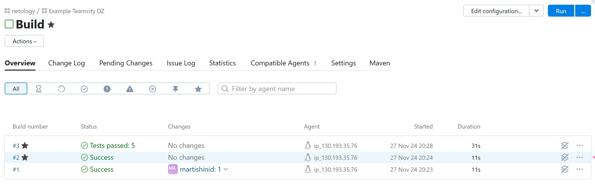
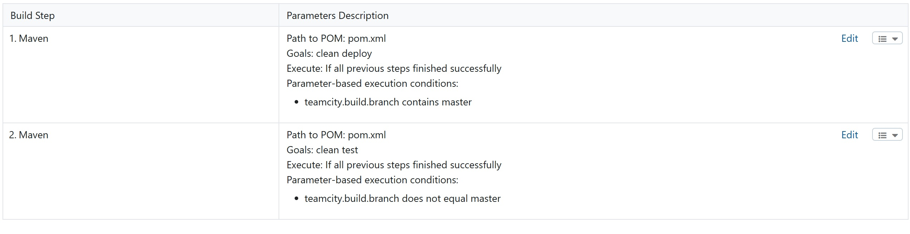
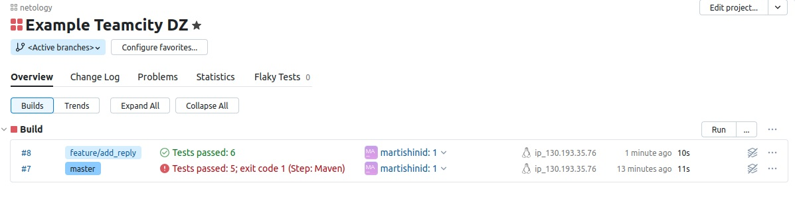

# Домашнее задание к занятию 11 «Teamcity»

## Подготовка к выполнению

1. В Yandex Cloud создайте новый инстанс (4CPU4RAM) на основе образа `jetbrains/teamcity-server`.
2. Дождитесь запуска teamcity, выполните первоначальную настройку.
3. Создайте ещё один инстанс (2CPU4RAM) на основе образа `jetbrains/teamcity-agent`. Пропишите к нему переменную окружения `SERVER_URL: "http://<teamcity_url>:8111"`.
4. Авторизуйте агент.
5. Сделайте fork [репозитория](https://github.com/aragastmatb/example-teamcity).
6. Создайте VM (2CPU4RAM) и запустите [playbook](./infrastructure).

## Основная часть

1. Создайте новый проект в teamcity на основе fork
2. Сделайте autodetect конфигурации
3. Сохраните необходимые шаги, запустите первую сборку master'a

4. Поменяйте условия сборки: если сборка по ветке `master`, то должен происходит `mvn clean package`, иначе `mvn clean test`

5. Мигрируйте `build configuration` в репозиторий  
[build configuration](https://github.com/martishinid/example-teamcity/blob/master/settings.kts)
6. Создайте отдельную ветку `feature/add_reply` в репозитории
7. Напишите новый метод для класса Welcomer: метод должен возвращать произвольную реплику, содержащую слово `hunter`
8. Дополните тест для нового метода на поиск слова `hunter` в новой реплике
9. Сделайте push всех изменений в новую ветку в репозиторий  
[feature/add_reply](https://github.com/martishinid/example-teamcity/tree/feature/add_reply)
10. Убедитесь что сборка самостоятельно запустилась, тесты прошли успешно

11. Внесите изменения из произвольной ветки `feature/add_reply` в `master` через `Merge`
12. Убедитесь, что нет собранного артефакта в сборке по ветке `master`
13. Настройте конфигурацию так, чтобы она собирала `.jar` в артефакты сборки
14. Проведите повторную сборку мастера, убедитесь, что сбора прошла успешно и артефакты собраны
15. Проверьте, что конфигурация в репозитории содержит все настройки конфигурации из teamcity
16. В ответ предоставьте ссылку на репозиторий  
[example-teamcity](https://github.com/martishinid/example-teamcity/)

---

### Как оформить решение задания

Выполненное домашнее задание пришлите в виде ссылки на .md-файл в вашем репозитории.

---
